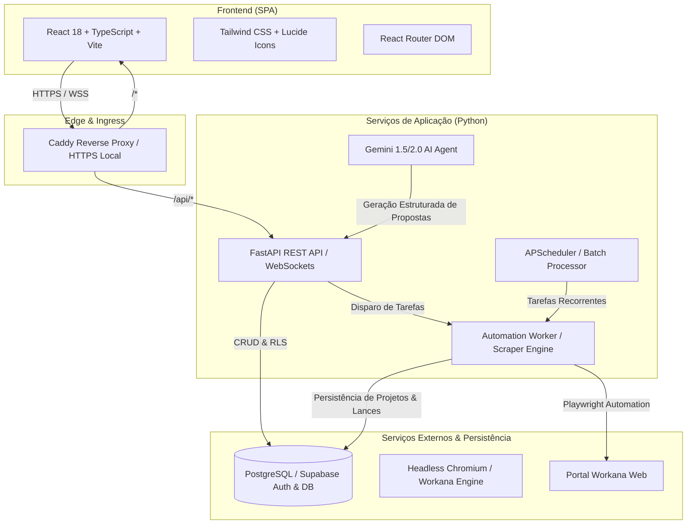
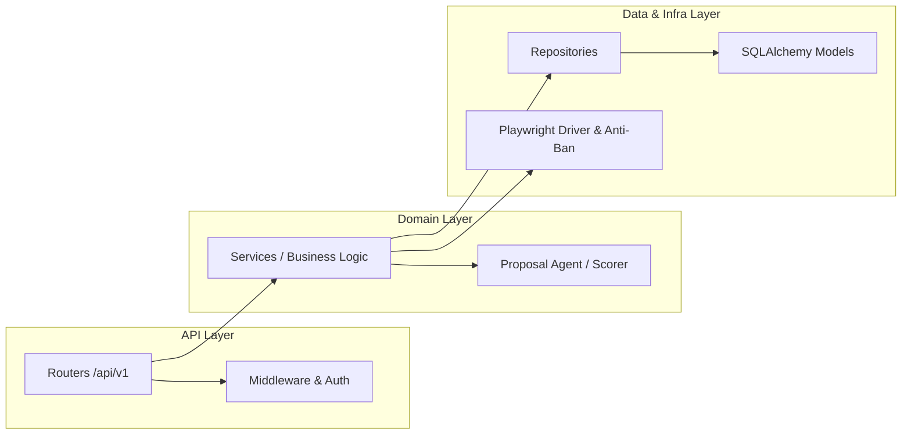

# Arquitetura do Sistema - Workana Accelerator

O **Workana Accelerator** é uma plataforma de engenharia de automação, prospecção e conversão de propostas para freelancers e agências no Workana. Este documento descreve os padrões de design, fluxo de dados e decisões arquiteturais do projeto no padrão de engenharia Big Tech.

---

## 1. Visão Geral da Topologia

O sistema é construído como uma aplicação distribuída, isolando a interface reativa, a API transacional e o worker de automação assíncrono:



---

## 2. Padrões de Camadas do Backend (Clean / Layered Architecture)

O backend segue estritamente a separação de responsabilidades em camadas desacopladas:



1. **API Layer (`app/api/routers/`)**:
   - Rotas REST e WebSocket focadas exclusivamente em protocolo HTTP, validação de payload com schemas Pydantic e controle de autenticação/autorização via JWT (Supabase Auth).
2. **Domain & Service Layer (`app/services/`)**:
   - Regras de negócio puras: cálculo de pontuação de projetos (`scorer.py`), construção de propostas consultivas com IA (`proposal_agent.py`, `gemini_factory.py`), processador de lotes (`batch_processor.py`) e conversão de moedas (`currency.py`).
3. **Data Access Layer (`app/database/repositories/`)**:
   - Padrão Repository isolando consultas complexas do SQLAlchemy (`select`, `where`, joins) do restante do código, garantindo manutenibilidade e facilidade de testes unitários com mocks.
4. **Automation & Ingestion Engine (`app/automation/`)**:
   - Drivers Playwright customizados com técnicas anti-fingerprint (`antiban.py`, `browser_driver.py`, `captcha_solver.py`).
   - Isolamento de credenciais e cookies com `session_manager.py`.

---

## 3. Padrões de Camadas do Frontend

O frontend adota arquitetura orientada a componentes, fortemente tipada e reativa:

```
frontend/src/
├── components/          # Componentes visuais atômicos e modulares
│   ├── ui/              # Primitivos de UI baseados em Radix & Shadcn
│   ├── projects/        # Cards, filtros, modais de propostas e lotes
│   └── templates/       # Construtor visual de blocos de propostas
├── pages/               # Views principais da aplicação (roteadas)
├── services/api/        # Clientes HTTP tipados para consumo do backend
├── context/             # Estados globais (AuthContext, ToastContext)
├── hooks/               # Custom hooks de lógica reutilizável
├── constants/           # Enums, categorias e configurações fixas
└── integrations/        # Integração direta com Supabase SDK
```

---

## 4. Garantia de Qualidade e Linters (Quality Gates)

O repositório adota ferramentas modernas para garantir conformidade estrita de código:

| Domínio | Ferramenta | Função | Comando |
| :--- | :--- | :--- | :--- |
| **Frontend Formatter** | Prettier | Formatação estrita de TSX, CSS, JSON, Markdown | `npm run format:frontend` |
| **Frontend Linter** | ESLint + TypeScript-ESLint | Análise estática de código React e boas práticas | `npm run lint:frontend` |
| **Frontend Tests** | Vitest + React Testing Library | Testes de componentes, fluxos de auth e hooks | `npm run test:frontend` |
| **Backend Formatter** | Ruff Format | Formatação PEP 8 ultra-rápida | `cd backend && python -m ruff format .` |
| **Backend Linter** | Ruff Check | Análise estática, detecção de bugs e segurança | `cd backend && python -m ruff check .` |
| **Backend Tests** | Pytest + pytest-asyncio | Testes unitários e de integração assíncronos | `cd backend && python -m pytest` |
| **Monorepo DX** | Root `package.json` | Orquestração central de todos os checks | `npm run format:all` / `npm run test:all` |

---

## 5. Práticas de Segurança e Isolamento

- **Zero Credenciais em Código**: `.env` e `.env.example` segregados; arquivos com credenciais ativas (`workana_storage_state.json`) estão bloqueados no `.gitignore` e `.prettierignore`.
- **Row-Level Security (RLS)**: No Supabase, tabelas isoladas por `user_id` para proteger a privacidade e conformidade de múltiplos usuários.
- **Resiliência Anti-Ban**: O worker de automação utiliza rotação de user-agents, pausas heurísticas aleatórias e renderização não controlada para prevenir flags automatizadas.
